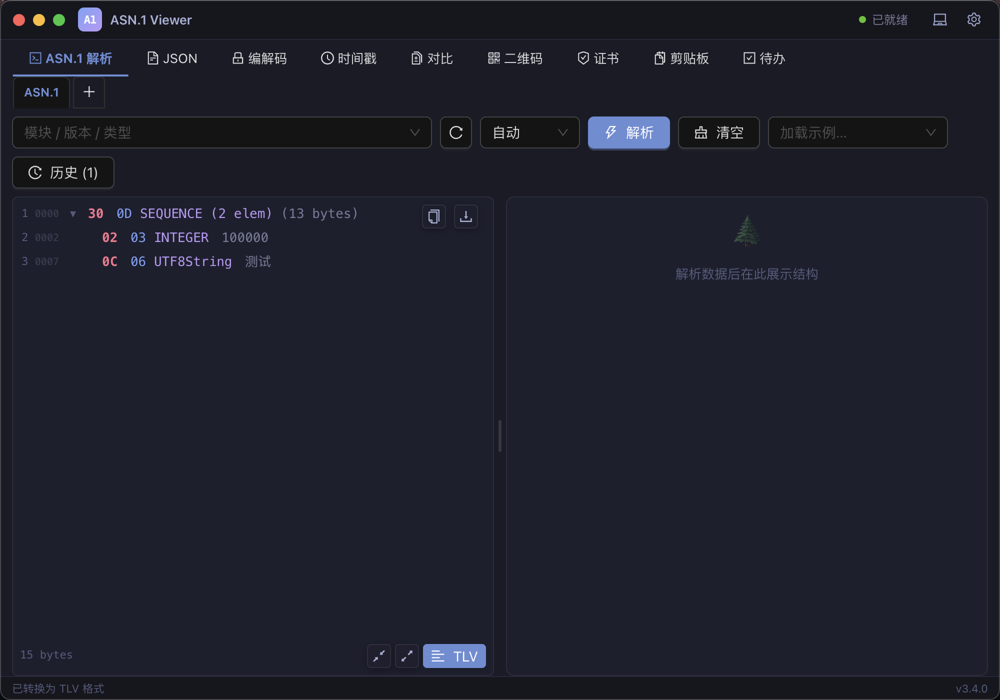

# ASN.1 Viewer

一款面向开发者的多功能桌面工具箱，基于 Electron + React + Java 构建，提供 ASN.1 解析、JSON 格式化、编解码、证书分析、剪贴板历史等一站式能力。

## 功能模块

| 模块 | 说明 |
|------|------|
| **ASN.1 解析** | 输入 Hex / Base64 / PEM 格式数据，结合自定义 ASN.1 模块进行结构化解析，树形展示字段名称与含义 |
| **JSON** | JSON 格式化、压缩、语法高亮，支持多标签页 |
| **编解码** | Base64 / URL / Hex 编解码；AES（ECB/CBC）加解密；RSA 公私钥加解密；Hash / HMAC 计算 |
| **时间戳** | Unix 时间戳与可读时间互转，支持毫秒/秒 |
| **对比** | 文本 Diff 对比，高亮差异行 |
| **二维码** | 二维码生成与识别（支持图片文件） |
| **证书** | X.509 证书解析，支持 PEM / DER / Base64 / Hex 输入，展示主体、颁发者、有效期、公钥、指纹等完整信息 |
| **剪贴板历史** | 自动记录剪贴板变更（文本 / 图片 / 文件），支持收藏、标签、搜索、分页、导出 |
| **待办** | 轻量级待办清单，支持设置提醒时间，到期系统通知推送 |

### 其他特性

- **悬浮按钮**：可选常驻悬浮球，快速跳转到任意功能模块并自动粘贴剪贴板内容
- **深色 / 浅色 / 跟随系统** 三种主题，实时切换
- **自定义 ASN.1 模块**：通过设置面板上传 JAR 包，扩展解析能力
- **开机自启动**、最小化到托盘
- 多标签页支持（ASN.1 / JSON / 对比 / 证书各自支持同时开多个标签）

## 技术栈

- **前端**：React 18 · TypeScript · Vite 6 · Ant Design 5
- **桌面**：Electron 33 · vite-plugin-electron
- **后端**：Java 21 服务（Gradle fatJar），通过 stdin/stdout JSON-RPC 与 Electron 主进程通信

## 环境要求

| 依赖 | 版本 |
|------|------|
| Node.js | 18+ |
| JDK | 21+ |

## 快速开始

```bash
# 安装前端依赖
npm install

# 开发模式（自动构建 Java 服务，首次较慢）
npm run dev
```

## 构建发布包

```bash
# 完整构建（强制重新编译 Java + 打包 Electron 应用）
npm run build:all
```

产物输出至 `release/` 目录：
- **macOS**：`ASN1-Viewer-1.0.0-arm64.dmg`
- **Windows**：`ASN1-Viewer-1.0.0-x64.exe`（NSIS 安装包）

### 单独构建 Java 服务

```bash
# 仅重新编译 Java（强制）
npm run java:build
```

> 默认情况下，`npm run dev` 检测到 FAT JAR 已存在会跳过 Java 编译。如需强制重新编译，运行 `npm run java:build`。

## 项目结构

```
asn1-tools/
├── electron/           # Electron 主进程
│   ├── main.ts         # 窗口管理、IPC 注册、托盘
│   ├── preload.ts      # 主窗口 contextBridge
│   ├── preload-float.ts# 悬浮球窗口 contextBridge
│   ├── java-bridge.ts  # Java 子进程管理 & JSON-RPC
│   ├── config-store.ts # 本地配置持久化
│   └── clipboard-store.ts # 剪贴板历史存储
├── src/                # React 渲染进程
│   ├── components/     # 各功能模块组件
│   ├── hooks/          # useTheme / useJavaStatus
│   ├── services/       # java-rpc.ts（IPC 封装）
│   └── styles/         # global.less
├── java-service/       # Java 后端（Gradle 项目）
├── scripts/
│   └── build-java.js   # Java 构建脚本
├── resources/          # 图标等静态资源
├── index.html          # 主窗口入口
├── float.html          # 悬浮球窗口入口
└── vite.config.ts
```

## License

UNLICENSED — 仅供个人使用
